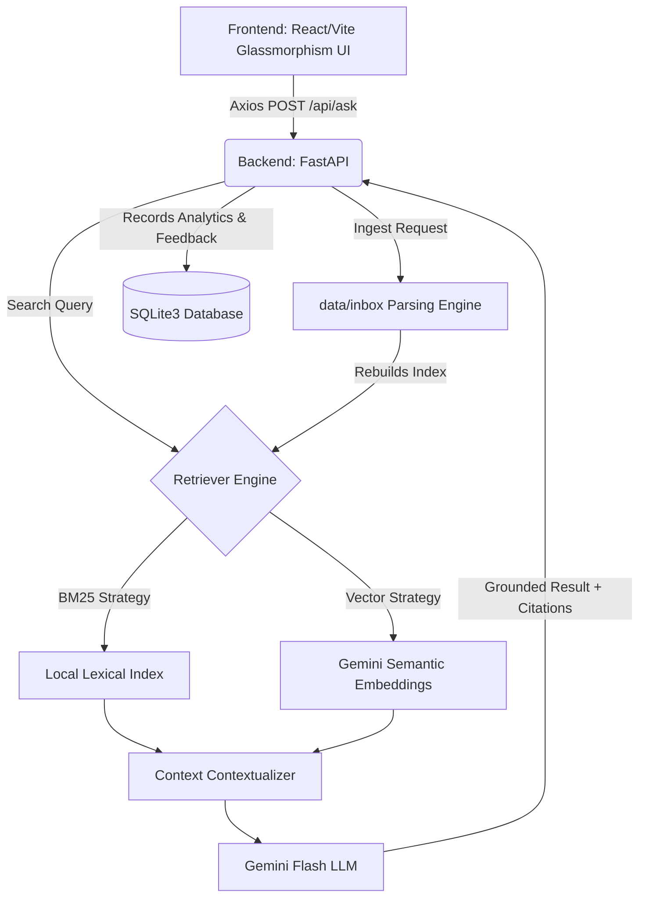

# DealDesk AI: RAG-Powered SaaS Copilot

DealDesk AI is an end-to-end Retrieval-Augmented Generation (RAG) platform tailored for SaaS sales engineers, leveraging localized BM25 indexes and Google's Gemini-3 embeddings for accurate feature comparison, objection handling, and competitor analysis.

## 🚀 Key Highlights
- **Dual-Index RAG Engine:** Built with intelligent fallbacks routing between Semantic Vectors (Gemini) and Lexical TF-IDF (BM25) to guarantee zero-hallucination competitor comparisons.
- **Dynamic Context Scaling:** Automatically expands the retrieval window up to 15 chunks based on comparative or open-ended intent detected within the query.
- **Glassmorphism UI:** Features a custom Vite/React frontend supporting Dark Mode aesthetics, full markdown document rendering, and user feedback pipelines.

## 🛠️ Tech Stack
- **Frontend:** React 18, Vite, React-Markdown, Vanilla CSS (Glassmorphism)
- **Backend:** FastAPI, Uvicorn, SQLite3 (Analytics Engine)
- **AI / Embeddings:** Google Gemini `gemini-3.1-flash-lite`, `gemini-embedding-001`
- **Data Pipeline:** Python (BeautifulSoup, NLTK) parsing 680+ public SaaS configuration guides

## 🗺️ Architecture

This workspace contains a public-docs dataset plan for a RAG-powered SaaS sales/support copilot.

## Data Sources

The starter set uses public docs and pricing pages from:

- Supabase: docs, pricing, auth, database, storage, realtime, edge functions, AI/vector docs.
- Firebase: docs, pricing, auth, Firestore, storage, hosting, functions, realtime database.
- Vercel: docs, pricing, deployments, functions, storage, security, frameworks, analytics.
- Render: docs, pricing, web services, PostgreSQL, deployment guides, blueprints, free tier.

These datasets power complex, enterprise-grade RAG workflows:

- Feature comparison across vendors.
- Pricing and free-tier Q&A.
- Customer objection handling.
- Migration and product-fit recommendations.
- Support response drafting with citations.

