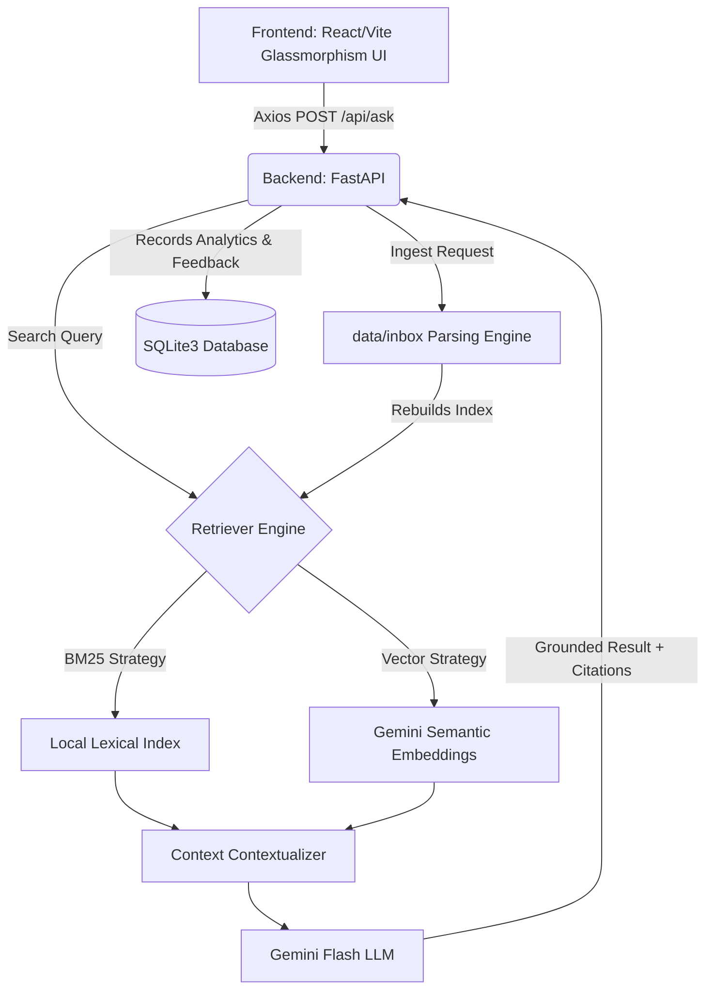

# DealDesk AI: RAG-Powered SaaS Copilot

DealDesk AI is an end-to-end Retrieval-Augmented Generation (RAG) platform tailored for SaaS sales engineers, leveraging localized BM25 indexes and Google's Gemini-3 embeddings for accurate feature comparison, objection handling, and competitor analysis.

## 🚀 Key Highlights
- **Dual-Index RAG Engine:** Built with intelligent fallbacks routing between Semantic Vectors (Gemini) and Lexical TF-IDF (BM25) to guarantee zero-hallucination competitor comparisons.
- **Dynamic Context Scaling:** Automatically expands the retrieval window up to 15 chunks based on comparative or open-ended intent detected within the query.
- **Glassmorphism UI:** Features a custom Vite/React frontend supporting Dark Mode aesthetics, full markdown document rendering, and user feedback pipelines.

## 🛠️ Tech Stack
- **Frontend:** React 18, Vite, React-Markdown, Vanilla CSS (Glassmorphism)
- **Backend:** FastAPI, Uvicorn, SQLite3 (Analytics Engine)
- **AI / Embeddings:** Google Gemini `gemini-3.1-flash-lite`, `gemini-embedding-001`
- **Data Pipeline:** Python (BeautifulSoup, NLTK) parsing 680+ public SaaS configuration guides

## 🗺️ Architecture



This workspace contains a public-docs dataset plan for a RAG-powered SaaS sales/support copilot.

## Data Sources

The starter set uses public docs and pricing pages from:

- Supabase: docs, pricing, auth, database, storage, realtime, edge functions, AI/vector docs.
- Firebase: docs, pricing, auth, Firestore, storage, hosting, functions, realtime database.
- Vercel: docs, pricing, deployments, functions, storage, security, frameworks, analytics.
- Render: docs, pricing, web services, PostgreSQL, deployment guides, blueprints, free tier.

These sources support resume-worthy workflows:

- Feature comparison across vendors.
- Pricing and free-tier Q&A.
- Customer objection handling.
- Migration and product-fit recommendations.
- Support response drafting with citations.

## Create the Dataset

Run:

```powershell
python scripts/crawl_public_docs.py --max-pages-per-source 40 --delay 1.2
python scripts/chunk_documents.py
```

Outputs:

- `data/public_docs/documents.jsonl`: one record per crawled page.
- `data/public_docs/chunks.jsonl`: RAG-ready text chunks.
- `data/public_docs/raw_html/`: saved HTML for traceability.

Start with `--max-pages-per-source 20` while developing. Increase it once your pipeline works.

## Run The RAG Pipeline

To build the local retriever index from all public docs and any new files in `data/inbox`, run:

```powershell
python scripts/run_rag_pipeline.py
```

Then test retrieval:

```powershell
python scripts/query_rag.py "Compare Firebase and Supabase for a SaaS MVP that needs auth, database, storage, and a generous free tier."
```

## Add New Documents

Drop supported files into `data/inbox`.

Supported local formats:

- `.txt`
- `.md`
- `.html`
- `.json`
- `.jsonl`
- `.pdf`
- `.docx`

If you want vendor/source names, create folders under `data/inbox`, for example:

```text
data/inbox/AcmeCloud/pricing_and_objections.md
data/inbox/MyStartup/refund_policy.pdf
```

Then rerun:

```powershell
python scripts/run_rag_pipeline.py
```

The pipeline will:

- ingest local files into `data/local_docs/documents.jsonl`
- combine public and local documents
- chunk everything into `data/rag/chunks.jsonl`
- rebuild the retriever index at `data/index/bm25_index.json`

Current verified baseline:

- 100 public vendor documents
- 1 local sample document
- 101 total documents
- 682 indexed chunks

Note: on this Windows machine, `python` was not available directly in the shell. I used the bundled Codex Python executable:

```powershell
& 'C:\Users\DELL\.cache\codex-runtimes\codex-primary-runtime\dependencies\python\python.exe' scripts/run_rag_pipeline.py
```

## UI Screenshots / Setup

*(Include images illustrating the React glassmorphic interface and UI document-upload modal behaviors here!)*

To spin up the entire Full-Stack pipeline easily via Docker:
```bash
docker-compose up --build
```
Vite will render at `http://localhost:5173` while FastAPI powers `http://localhost:8000`.

## Ask DealDesk AI

Retrieval-only mode works without an API key:

```powershell
python scripts/ask_dealdesk.py "What should I say if a customer says AcmeCloud is more expensive than basic hosting?" --mode objection --no-gemini
```

For generated cited answers, create `.env` from `.env.example` and set:

```text
GEMINI_API_KEY=your_google_ai_studio_key_here
GEMINI_MODEL=gemini-3.1-flash-lite
```

Then run:

```powershell
python scripts/ask_dealdesk.py "Compare Firebase and Supabase for a SaaS MVP that needs auth, database, storage, and a generous free tier." --mode compare
```

## Semantic Vector Retrieval

BM25 is available locally for free. For better semantic retrieval, build a Gemini embedding index:

```powershell
python scripts/build_vector_index.py --resume
```

For a quick smoke test:

```powershell
python scripts/build_vector_index.py --limit 20
python scripts/query_vector.py "Which platform is better for auth and managed database?"
```

Once the vector index exists, use hybrid retrieval:

```powershell
python scripts/ask_dealdesk.py "Which platform is better for auth and managed database?" --retriever hybrid --mode recommend
```

The default embedding model is `gemini-embedding-001`, which supports retrieval-specific task types and is cheaper than `gemini-embedding-2` for text-only use.

## Recommended RAG Metadata

Every chunk should keep:

- `vendor`
- `source_url`
- `title`
- `chunk_index`
- `doc_id`

This lets the app show citations and filter answers by vendor.

## Good Demo Questions

- Compare Firebase and Supabase authentication for a small SaaS MVP.
- Which platform is better if I need Postgres and predictable pricing?
- Draft a reply to a customer asking why our hosting costs more than Render.
- What free-tier limits should I mention when recommending Vercel?
- Give me a cited comparison of deployment options across Vercel and Render.
